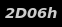

# Uptime-Indicator
_Uptime Indicator gnome-shell extension_

This gnome-shell extension indicates the system uptime in status area. When
clicked, a popup menu indicates the date when the system was started.

To install, please use the [gnome extensions website](https://extensions.gnome.org/extension/508/uptime-indicator/).

Contributions welcome!
